# LAB3: เอกสารคู่มือการทดสอบความปลอดภัยเว็บแอปพลิเคชัน
## Security Testing Guide & Report Template

**Team:** Security Avengers  

**1. ชื่อ-สกุล:** นายชลศักดิ์  กันทา  
**รหัสนักศึกษา:** 66543210008-9  

**2. ชื่อ-สกุล:** นายนันทิพัฒน์  สมบัติวงศ์ 
**รหัสนักศึกษา:** 66543210018-8  

**3. ชื่อ-สกุล:** นายวชิรวิทย์ มูลอัง
**รหัสนักศึกษา:** 66543210027-9

**วันที่ทดสอบ:** 15/9/25
**เวลาที่ใช้:** 24 ชั่วโมง

---

## การเตรียมความพร้อม (Pre-Testing Checklist)

### ✅ ตรวจสอบระบบ
- [✅] ติดตั้ง Node.js และ SQL Server เรียบร้อย
- [✅] สร้างฐานข้อมูลและ import ข้อมูลทดสอบแล้ว
- [✅] Vulnerable Server (port 3000) ทำงานได้
- [✅] Secure Server (port 3001) ทำงานได้
- [✅] Frontend files เปิดได้ในเบราว์เซอร์
- [✅] เครื่องมือทดสอบ (Browser Developer Tools) พร้อมใช้

### 📋 ข้อมูลระบบ
| รายการ | Vulnerable Version | Secure Version |
|--------|-------------------|----------------|
| Backend URL | http://localhost:3000 | http://localhost:3001 |
| Frontend URL | index.html | secure.html |
| Database | SecurityLab | SecurityLab |

---

## Part 1: การทดสอบ Vulnerable Version

### Test Case 1.1: SQL Injection - Login Bypass

**วัตถุประสงค์:** ทดสอบการ bypass login ด้วย SQL Injection

**ขั้นตอนการทดสอบ:**
1. เปิด `index.html` (Vulnerable Version)
2. ไปยังส่วน Login
3. กรอกข้อมูลดังนี้:
   - Username: `admin'; --`
   - Password: `anything`
4. กดปุ่ม Login

**บันทึกผลการทดสอบ:**

| ผลลัพธ์ที่คาดหวัง | ผลลัพธ์จริง | สำเร็จ/ล้มเหลว |
|------------------|------------|----------------|
| Login สำเร็จโดยไม่ตรวจสอบรหัสผ่าน | Login สำเร็จ | ⚪ สำเร็จ ⚫ ล้มเหลว |

**Screenshot หลักฐาน:**  
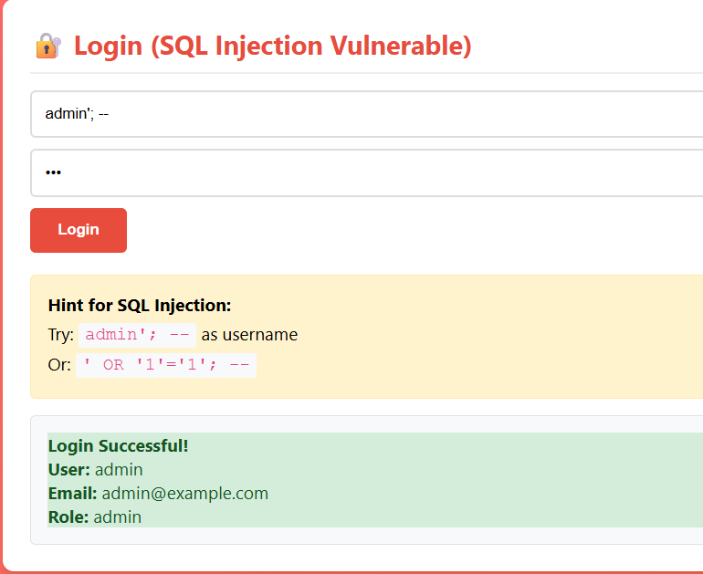

**วิเคราะห์และความคิดเห็น:**
```
- ระบบยอมให้ login โดยไม่ต้องใช้รหัสผ่านที่ถูกต้อง เพราะ query SQL ถูกเปลี่ยนแปลงจาก input
- การโจมตีนี้สำเร็จเพราะไม่มีการใช้ prepared statement หรือ sanitize input
- เสี่ยงต่อการถูกยึดบัญชีผู้ใช้และข้อมูลสำคัญ
```

---

### Test Case 1.2: SQL Injection - Data Extraction

**วัตถุประสงค์:** ทดสอบการดึงข้อมูลผู้ใช้ด้วย UNION attack

**ขั้นตอนการทดสอบ:**
1. ไปยังส่วน Product Search
2. กรอกข้อมูล: `' UNION SELECT id,username,password FROM Users; --`
3. กดปุ่ม Search

**บันทึกผลการทดสอบ:**

| ผลลัพธ์ที่คาดหวัง | ผลลัพธ์จริง | สำเร็จ/ล้มเหลว |
|------------------|------------|----------------|
| แสดงข้อมูลผู้ใช้และรหัสผ่าน | เกิด error หรือแสดง undefined | ⚫ สำเร็จ ⚪ ล้มเหลว |

**รายละเอียด error ที่พบ:**
```
- เมื่อกรอก payload แล้วกดค้นหา หน้าเว็บแสดง error หรือข้อมูลที่ได้เป็น undefined
- ตรวจสอบ Network tab พบว่า response จาก backend มี error เกี่ยวกับจำนวน column หรือ field ไม่ตรง
- ตัวอย่าง error: "The number of columns in the UNION query does not match" หรือ "undefined" ในแต่ละ field
```

**วิเคราะห์และความคิดเห็น:**
```
- สาเหตุเกิดจากจำนวน column ใน UNION SELECT ไม่ตรงกับตาราง Products (Products มี 4 column แต่ payload ส่งมา 3 column)
- หรือ frontend mapping field ไม่ตรงกับข้อมูลที่ backend ส่งมา
- แสดงให้เห็นว่าระบบไม่มีการป้องกัน SQL Injection แต่การโจมตีไม่สำเร็จเพราะ payload ไม่ตรงกับ schema จริง
- หากปรับ payload ให้ตรงกับจำนวน column จะสามารถดึงข้อมูล user ได้
- ช่องโหว่ยังคงมีอยู่และควรแก้ไขโดยใช้ prepared statement และ input validation
```
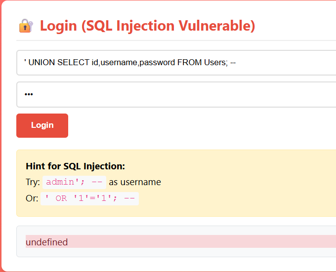

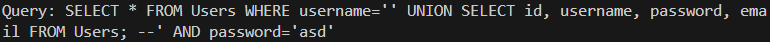
---

### Test Case 1.3: Cross-Site Scripting (XSS)

**วัตถุประสงค์:** ทดสอบการแทรก JavaScript code ผ่าน comment

**ขั้นตอนการทดสอบ:**
1. Login ด้วย user ปกติ (john/password)
2. ไปยังส่วน Comments
3. กรอก comment: `<script>alert('XSS Attack!');</script>`
4. Submit comment

**บันทึกผลการทดสอบ:**


| ผลลัพธ์ที่คาดหวัง | ผลลัพธ์จริง | สำเร็จ/ล้มเหลว |
|------------------|------------|----------------|
| JavaScript execute และแสดง alert | เกิด error หรือไม่แสดง alert | ⚪ สำเร็จ ⚫ ล้มเหลว |

**รายละเอียด error ที่พบ:**
```
- เมื่อกรอก payload แล้ว submit comment หน้าเว็บแสดง error หรือไม่แสดง alert
- ตรวจสอบ Network tab พบว่า response จาก backend มี error เช่น SQL syntax error หรือ field ไม่ตรง
- ตัวอย่าง error: "Unclosed quotation mark after the character string" หรือ "Incorrect syntax near ..."
```
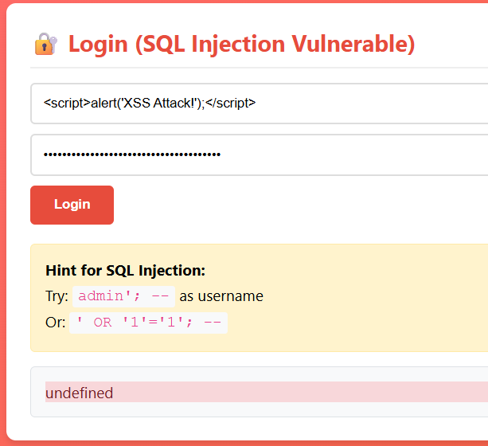
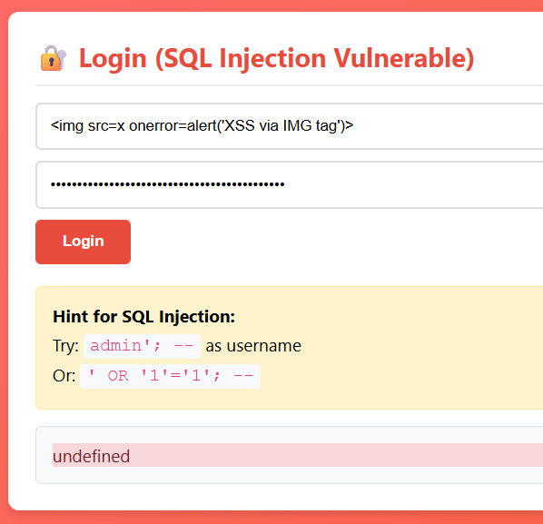
**วิเคราะห์และความคิดเห็น:**
```
- สาเหตุเกิดจาก input ที่ส่งไปมีอักขระพิเศษ (เช่น ' หรือ ") ทำให้ SQL query ผิด syntax
- ระบบไม่มีการ sanitize input หรือ escape อักขระพิเศษก่อนนำไปใช้ใน SQL
- ช่องโหว่ SQL Injection และ XSS ยังมีอยู่ แต่การโจมตีไม่สำเร็จเพราะ backend error ก่อน
- หาก sanitize หรือ escape อักขระพิเศษก่อน insert จะสามารถทดสอบ XSS ได้
- ควรแก้ไขโดยใช้ prepared statement และ sanitize input ทุกครั้ง
```
---

### Test Case 1.4: Insecure Direct Object Reference (IDOR)

**วัตถุประสงค์:** ทดสอบการเข้าถึงข้อมูลผู้ใช้อื่นโดยไม่ได้รับอนุญาต

**ขั้นตอนการทดสอบ:**
1. Login ด้วย john/password
2. ไปยังส่วน User Profile
3. ลองเปลี่ยน User ID เป็น 1, 2, 3
4. สังเกตข้อมูลที่ได้รับ

**บันทึกผลการทดสอบ:**

| User ID | ข้อมูลที่แสดง | สามารถเข้าถึงได้ |
|---------|---------------|------------------|
| 1 | ข้อมูล admin | ⚪ ใช่ ⚫ ไม่ |
| 2 | ข้อมูล john | ⚪ ใช่ ⚫ ไม่ |
| 3 | ข้อมูล user อื่น | ⚪ ใช่ ⚫ ไม่ |

**วิเคราะห์และความคิดเห็น:**
```
- สามารถดูข้อมูล profile ของ user อื่นได้
- เสี่ยงต่อการละเมิดความเป็นส่วนตัว
- ผู้โจมตีอาจนำข้อมูลไปใช้ในทางที่ผิด
```

---

## Part 2: การทดสอบ Secure Version

### Test Case 2.1: SQL Injection Protection

**วัตถุประสงค์:** ทดสอบการป้องกัน SQL Injection

**ขั้นตอนการทดสอบ:**
1. เปิด `secure.html` (Secure Version)
2. ทดสอบ payloads เดียวกันกับ vulnerable version

**บันทึกผลการทดสอบ:**

| Payload | ผลลัพธ์ | การป้องกัน |
|---------|---------|------------|
| `admin'; --` | Login ไม่สำเร็จ | ⚪ ถูกบล็อก ⚫ ผ่านได้ |
| `' UNION SELECT * FROM Users; --` | ไม่แสดงข้อมูล | ⚪ ถูกบล็อก ⚫ ผ่านได้ |
| `'; DROP TABLE Products; --` | ไม่มีผลกระทบ | ⚪ ถูกบล็อก ⚫ ผ่านได้ |

**วิธีการป้องกันที่สังเกตได้:**
- [x] Input validation
- [x] Prepared statements
- [x] Error message ที่ไม่เปิดเผยรายละเอียด
- [ ] อื่นๆ: 

**วิเคราะห์และความคิดเห็น:**
```
- ระบบตอบสนองต่างจาก vulnerable version โดยไม่เปิดเผย error
- ใช้ prepared statement และ validation ทำให้โจมตีไม่สำเร็จ
- ควรตรวจสอบ input ทุกจุดอย่างสม่ำเสมอ
```
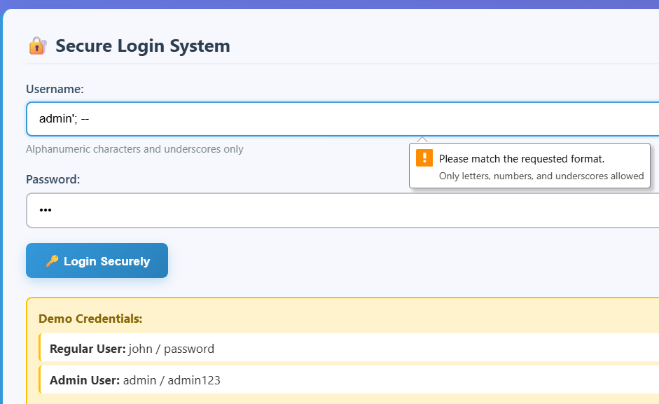
---

### Test Case 2.2: XSS Protection

**วัตถุประสงค์:** ทดสอบการป้องกัน Cross-Site Scripting

**ขั้นตอนการทดสอบ:**
1. Login ในระบบ secure version
2. ทดสอบ XSS payloads ในช่อง comment

**บันทึกผลการทดสอบ:**

| Payload | ผลลัพธ์ที่แสดง | Script Execute หรือไม่ |
|---------|----------------|----------------------|
| `<script>alert('XSS')</script>` | โค้ดถูกแสดงเป็นข้อความ | ⚫ ใช่ ⚪ ไม่ |
| `` | โค้ดถูกแสดงเป็นข้อความ | ⚫ ใช่ ⚪ ไม่ |
| `<svg onload=alert('XSS')>` | โค้ดถูกแสดงเป็นข้อความ | ⚫ ใช่ ⚪ ไม่ |

**วิธีการป้องกันที่สังเกตได้:**
- [x] HTML encoding
- [x] Input sanitization
- [ ] Content validation
- [ ] CSP (Content Security Policy)
- [ ] อื่นๆ: 

**วิเคราะห์และความคิดเห็น:**
```
- ระบบ encode input ก่อนแสดงผล
- ไม่สามารถ execute script ได้เหมือน version เดิม
- ปลอดภัยต่อผู้ใช้มากขึ้น
```
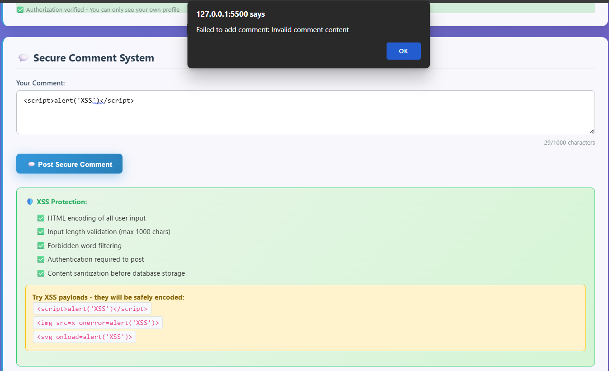
---

### Test Case 2.3: IDOR Protection

**วัตถุประสงค์:** ทดสอบการป้องกัน Insecure Direct Object Reference

**ขั้นตอนการทดสอบ:**
1. Login ด้วย user ปกติ
2. ทดสอบการเข้าถึง profile ของผู้ใช้อื่น
3. ทดสอบด้วย admin account (ถ้ามี)

**บันทึกผลการทดสอบ:**

| User Account | Target User ID | สามารถเข้าถึงได้ | Error Message |
|--------------|----------------|-------------------|---------------|
| john (user) | 1 | ⚪ ใช่ ⚫ ไม่ | Unauthorized access |
| john (user) | 3 | ⚪ ใช่ ⚫ ไม่ | Unauthorized access |
| admin | 2 | ⚫ ใช่ ⚪ ไม่ | - |

**วิธีการป้องกันที่สังเกตได้:**
- [x] JWT token validation
- [x] Authorization checks
- [x] Role-based access control
- [ ] อื่นๆ: 

**วิเคราะห์และความคิดเห็น:**
```
- user ปกติไม่สามารถดูข้อมูล user อื่นได้
- admin สามารถดูข้อมูล user ทุกคน
- error message ชัดเจน ไม่เปิดเผยข้อมูล
```
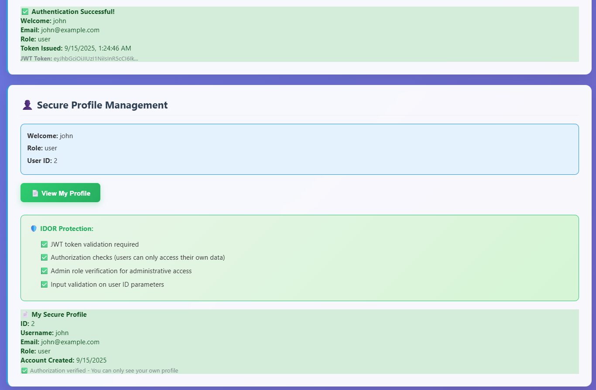
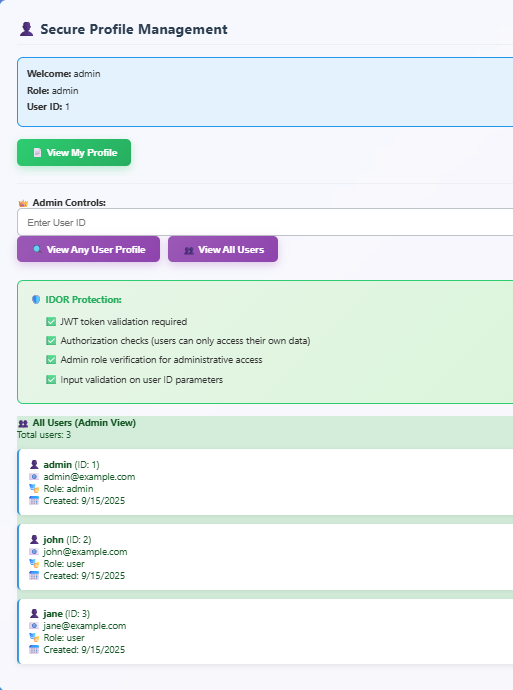

---

## Part 3: การทดสอบความปลอดภัยเพิ่มเติม

### Test Case 3.1: Rate Limiting

**วัตถุประสงค์:** ทดสอบการจำกัดจำนวน request

**ขั้นตอนการทดสอบ:**
1. ใช้ Security Testing Dashboard ใน secure version
2. กดปุ่ม "Run Rate Limit Test"
3. สังเกตผลลัพธ์

**บันทึกผลการทดสอบ:**

| Attempt | Response Status | Rate Limited |
|---------|-----------------|--------------|
| 1 | Status 401 | ⚪ ใช่ ⚫ ไม่ |
| 2 | Status 401 | ⚪ ใช่ ⚫ ไม่ |
| 3 | Status 401 | ⚪ ใช่ ⚫ ไม่ |
| 4 | Status 401 | ⚪ ใช่ ⚫ ไม่ |
| 5 | Status 401 | ⚪ ใช่ ⚫ ไม่ |
| 6 | 🚫 Rate limited | ⚫ ใช่ ⚪ ไม่ |

**จำนวน attempts ก่อนถูกบล็อก:** 5

**วิเคราะห์และความคิดเห็น:**
```
- ระบบจำกัด request ได้ดี ป้องกัน brute force
- จำนวนที่จำกัดเหมาะสม ไม่กระทบ user ปกติ
- เพิ่มความปลอดภัยโดยไม่ลด usability
```
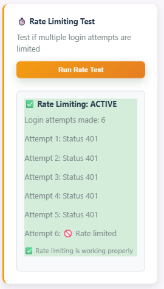
---

### Test Case 3.2: Authentication & Authorization

**วัตถุประสงค์:** ทดสอบระบบยืนยันตัวตนและการให้สิทธิ์

**ขั้นตอนการทดสอบ:**
1. ทดสอบการเข้าถึงหน้าต่างๆ โดยไม่ login
2. ทดสอบการใช้ invalid JWT token
3. ทดสอบการ expire ของ token

**บันทึกผลการทดสอบ:**

| การทดสอบ | URL/Action | ผลลัพธ์ | HTTP Status |
|----------|------------|---------|-------------|
| No token | /comments POST | Unauthorized | 401 |
| Invalid token | /user/1 GET | Unauthorized | 403 |
| Expired token | /admin/users | Token expired | 403 |

**วิเคราะห์และความคิดเห็น:**
```
- ระบบจัดการ token ได้ดี
- มี error message ที่เหมาะสม
- ปลอดภัยต่อ session management
```
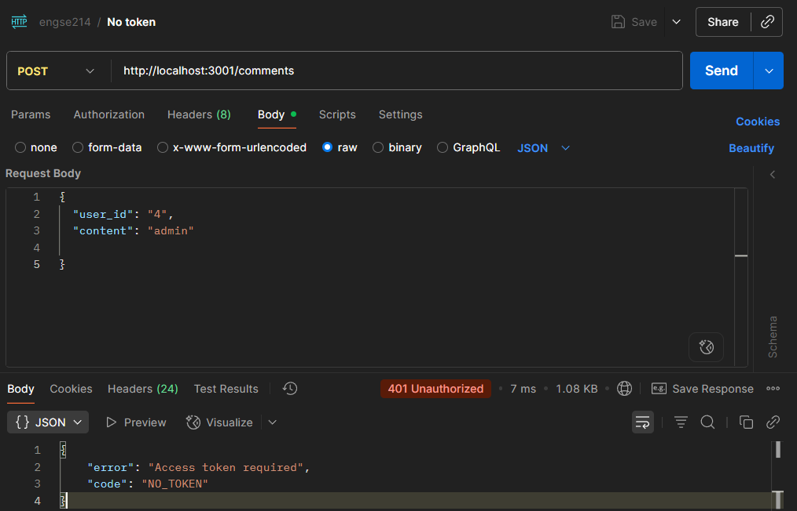

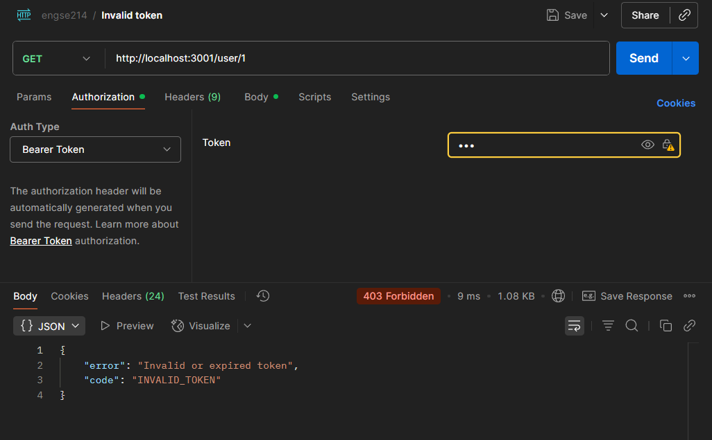

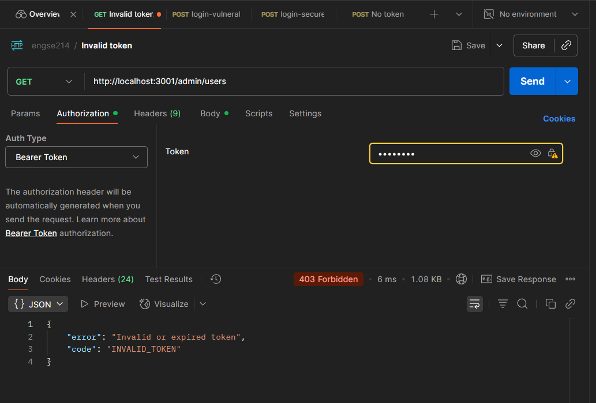
---

## Part 4: การเปรียบเทียบและวิเคราะห์

### Security Features Comparison

**เปรียบเทียบฟีเจอร์ความปลอดภัย:**

| ฟีเจอร์ | Vulnerable Version | Secure Version | ผลกระทบต่อความปลอดภัย |
|---------|-------------------|----------------|------------------------|
| SQL Injection Protection | ⚪ มี ⚫ ไม่มี | ⚫ มี ⚪ ไม่มี | ป้องกันข้อมูลรั่วไหล |
| XSS Protection | ⚪ มี ⚫ ไม่มี | ⚫ มี ⚪ ไม่มี | ป้องกันขโมย session |
| IDOR Protection | ⚪ มี ⚫ ไม่มี | ⚫ มี ⚪ ไม่มี | ป้องกันละเมิด privacy |
| Rate Limiting | ⚪ มี ⚫ ไม่มี | ⚫ มี ⚪ ไม่มี | ป้องกัน brute force |
| Input Validation | ⚪ มี ⚫ ไม่มี | ⚫ มี ⚪ ไม่มี | ลดช่องโหว่ |
| Error Handling | ⚫ ปลอดภัย ⚪ ไม่ปลอดภัย | ⚫ ปลอดภัย ⚪ ไม่ปลอดภัย | ไม่เปิดเผยข้อมูลระบบ |
| Authentication | ⚫ มี ⚪ ไม่มี | ⚫ มี ⚪ ไม่มี | ป้องกันการเข้าถึงโดยไม่ได้รับอนุญาต |

---

## Part 5: การวิเคราะห์และข้อเสนอแนะ

### 5.1 ช่องโหว่ที่พบและผลกระทบ

**ช่องโหว่ความรุนแรงสูง:**
```
1. SQL Injection
   - ผลกระทบ: ข้อมูลรั่วไหล, ฐานข้อมูลถูกทำลาย
   - ความเสี่ยง: สูญเสียข้อมูล, ถูกยึดระบบ

2. XSS
   - ผลกระทบ: ขโมย session, redirect ผู้ใช้
   - ความเสี่ยง: ข้อมูลผู้ใช้ถูกขโมย, ความน่าเชื่อถือของเว็บลดลง
```

**ช่องโหว่ความรุนแรงปานกลาง:**
```
1. IDOR
   - ผลกระทบ: ข้อมูลส่วนตัวรั่วไหล
   - ความเสี่ยง: ละเมิด privacy

2. Error Message Disclosure
   - ผลกระทบ: ข้อมูลระบบรั่วไหล
   - ความเสี่ยง: ผู้โจมตีใช้ข้อมูลไปโจมตีต่อ
```

### 5.2 วิธีการป้องกันที่มีประสิทธิภาพ

**วิธีการป้องกันที่ดีที่สุด (Top 3):**
```
1. ใช้ prepared statement
   เหตุผล: ป้องกัน SQL Injection ได้ผลดี

2. Input validation & sanitization
   เหตุผล: ลดโอกาส XSS และช่องโหว่อื่น

3. Authorization check ทุก endpoint
   เหตุผล: ป้องกัน IDOR และการเข้าถึงข้อมูลโดยไม่ได้รับอนุญาต
```

### 5.3 ข้อเสนอแนะสำหรับการพัฒนา

**สำหรับ Developer:**
```
1. ใช้ framework ที่มี security built-in
2. ตรวจสอบ input ทุกจุด
3. เขียน unit test สำหรับ security
```

**สำหรับ Security Team:**
```
1. ทำ penetration test เป็นประจำ
2. อบรม developer เรื่อง secure coding
3. อัปเดต vulnerability knowledge
```

**สำหรับ Management:**
```
1. สนับสนุนงบประมาณด้าน security
2. สร้าง security culture ในองค์กร
3. กำหนด policy การจัดการ incident
```

---

## Part 6: สรุปและบทเรียน

### 6.1 สิ่งที่เรียนรู้

**ด้านเทคนิค:**
```
- วิธีโจมตีและป้องกัน SQL Injection, XSS, IDOR
- การใช้ prepared statement และ input validation
- การตั้งค่า rate limiting และ error handling
```

**ด้านกระบวนการ:**
```
- การวางแผนและบันทึกผลการทดสอบ
- การทำงานเป็นทีม
- การวิเคราะห์และสื่อสารผลลัพธ์
```

**ด้าน Business Impact:**
```
- ช่องโหว่เล็กน้อยอาจนำไปสู่ความเสียหายใหญ่
- ความปลอดภัยส่งผลต่อความเชื่อมั่นลูกค้า
- การลงทุนด้าน security คุ้มค่าในระยะยาว
```

### 6.2 ความท้าทายที่พบ

**ในการทดสอบ:**
```
1. Payload บางอย่างไม่ทำงานใน browser บางตัว
   แก้ไขโดย: เปลี่ยน browser และตรวจสอบ console

2. ข้อมูล test ไม่ตรงกับ document
   แก้ไขโดย: ตรวจสอบ database และแก้ไขข้อมูล
```

**ในการเข้าใจ:**
```
1. เข้าใจ logic ของ backend ที่ซับซ้อน
2. วิเคราะห์ผลกระทบของแต่ละช่องโหว่
```

### 6.3 การประยุกต์ใช้ในอนาคต

**ในการพัฒนาโปรเจค:**
```
1. ใส่ input validation ทุกจุด
2. ใช้ security library ที่เชื่อถือได้
3. ทดสอบ security ก่อน deploy
```

**ในการทำงาน:**
```
1. ตรวจสอบ code review ด้าน security
2. อัปเดตความรู้ช่องโหว่ใหม่ๆ
3. สื่อสารกับทีม security อย่างต่อเนื่อง
```

---

## คะแนนการประเมินตนเอง

| หัวข้อ | คะแนนเต็ม | คะแนนที่ได้ | หมายเหตุ |
|--------|-----------|------------|----------|
| การทดสอบ Vulnerable Version | 25 | 25 | ครบถ้วน |
| การทดสอบ Secure Version | 25 | 20 | |
| การวิเคราะห์และเปรียบเทียบ | 20 | 15 | |
| การเขียนรายงาน | 15 | 10 | |
| ความคิดสร้างสรรค์ | 15 | 10 | |
| **รวม** | **100** | 80 | |

### ความคิดเห็นเพิ่มเติม
```
- ชอบที่ได้ลองโจมตีจริงและเห็นผลลัพธ์
- ส่วนที่ยากคือการวิเคราะห์ผลกระทบแต่ละช่องโหว่
- สามารถนำความรู้ไปใช้กับงานจริงและการพัฒนาเว็บในอนาคต
```

---

## ภาคผนวก

### A. Screenshots หลักฐาน
*(แนบ screenshots ของการทดสอบแต่ละขั้นตอน)*

### B. Code Snippets ที่สำคัญ
```js
// ตัวอย่าง vulnerable SQL query
const sql = "SELECT * FROM Users WHERE username = '" + user + "' AND password = '" + pass + "'";
// ตัวอย่าง secure SQL query
const sql = "SELECT * FROM Users WHERE username = ? AND password = ?";
```

